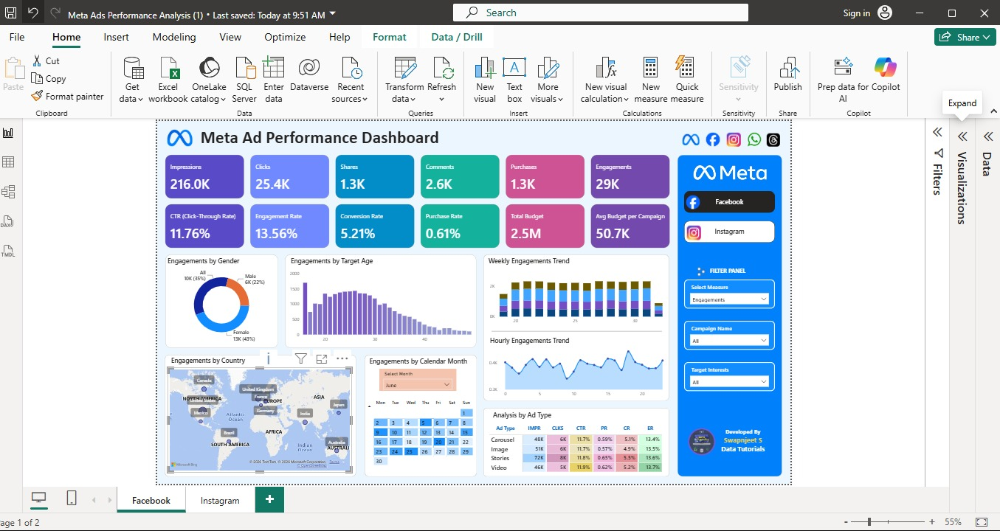
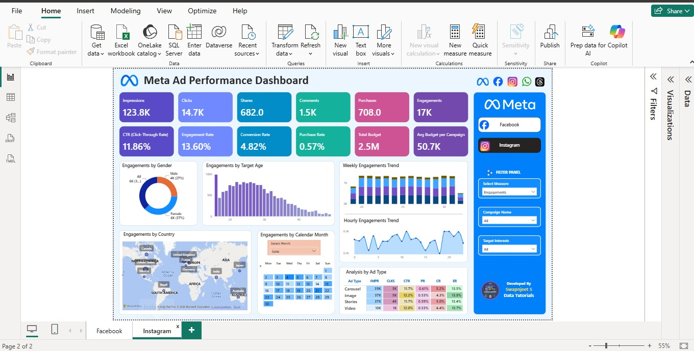

# Meta Ad Performance Analysis Dashboard

## Project Overview

Developed an interactive Power BI dashboard to analyze advertising campaign performance across Facebook and Instagram platforms. The dashboard provides insights into campaign reach, audience engagement, conversions, and budget utilization to support data-driven marketing decisions.

## Business Objective

The objective of this project is to monitor and evaluate Meta advertising campaigns by tracking key performance metrics and identifying opportunities to improve campaign effectiveness and ROI.

## Tools Used

- Power BI
- DAX
- Power Query
- Excel

## Key KPIs

- Impressions
- Clicks
- Shares
- Comments
- Purchases
- Engagements
- CTR (Click Through Rate)
- Engagement Rate
- Conversion Rate
- Purchase Rate
- Total Budget
- Average Budget per Campaign

## Dashboard Features

### Audience Analysis

- Engagement by Gender
- Engagement by Age Group
- Country-wise Performance Analysis

### Campaign Performance Analysis

- Impressions Analysis
- Click Analysis
- Purchase Analysis
- Conversion Analysis
- Budget Analysis

### Trend Analysis

- Weekly Engagement Trends
- Hourly Engagement Trends
- Monthly Activity Analysis

### Ad Performance Analysis

- Ad Type Performance
- Platform-wise Comparison
- Campaign-wise Analysis

## Business Impact

- Improved campaign performance visibility.
- Supported audience targeting strategies.
- Enabled data-driven budget allocation.
- Facilitated campaign optimization.

## Dashboard Screenshots

### Facebook Dashboard

### Instagram Dashboard

